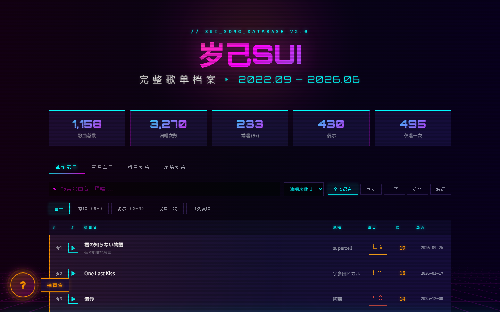

# 岁己SUI 歌单档案

> **SUI_SONG_DATABASE V4.1** — 为虚拟主播 [岁己SUI](https://space.bilibili.com/1954091502) 打造的 Vaporwave 风格歌单网站，配有岁己SUI角色插画背景

收录 **1,156** 首歌曲、**3,294** 次演唱记录，支持在线播放 B站录播片段。

**[>>> 在线预览 <<<](https://tsingyun.github.io/sui-song-list-new/)**

<p align="center">
  
</p>

> Fork 自 [PQL87/sui-song-list](https://github.com/PQL87/sui-song-list) 的数据，重新设计并构建。经过多轮数据清洗和功能迭代。

---

## Features

```
# sui-song-list-new

架构:
+ 单文件 HTML 架构
  - 所有 CSS / JS / 数据内嵌，零外部依赖
  - 可直接用浏览器打开，也可通过 GitHub Pages 部署
  - 文件体积约 698 KB（含 1156 首歌曲完整数据 + 1231 首日期记录 + 背景插画 WebP）
  - 外部依赖：SheetJS（xlsx）CDN 用于 Excel 导出、Chart.js CDN 用于数据可视化图表

数据:
+ 多源数据整合
  - 基础歌单数据来自 suijisui.space（PQL87/sui-song-list）
  - B站视频数据来自 3 个投稿合集（2146 个视频）
  - 手动校正语言分类和原唱归属
  - 合并重复歌曲、统一拼写、修正艺术家名称
  - 演唱日期数据来自 suijisui.space + 本地 Excel 记录

歌单显示:
+ 四视角浏览
  - 全部歌曲 — 完整歌单，支持搜索 / 排序 / 筛选 / 分页
  - 常唱金曲 — 按演唱频率分组（5+ 次 / 2–4 次 / 仅 1 次）
  - 语言分类 — 中文 / 日语 / 英文 / 韩语 分组浏览
  - 原唱分类 — 按原唱歌手聚合，显示代表作和演唱次数

+ 搜索与排序
  - 歌名 / 原唱模糊搜索（实时过滤）
  - 搜索关键词高亮（匹配文本用 <mark> 标签标注，一眼定位）
  - 多维排序：演唱次数 / 歌曲名称 / 首次日期 / 最近日期
  - 快捷筛选：常唱 (5+) / 偶尔 (2–4) / 仅唱一次 / 很久没唱
  - 分页浏览（50 首/页）

+ 语言筛选
  - 中文 / 日语 / 英文 / 韩语 分类过滤
  - 自动修正语言标注（根据艺术家国籍而非歌名判断）

歌曲分类标签:
+ 23 种音乐流派标签
  - 每首歌曲最多 3 个标签（流行/摇滚/抒情/Vocaloid/动画/古风 等）
  - 标签来源：~412 首人工标注 + ~137 位艺术家默认标签 + 语言兜底
  - 标签筛选栏：点击标签过滤歌单，显示各标签歌曲数量
  - 彩色标签徽章：每种标签独立配色，缩小显示于歌名右侧

数据洞察:
+ 四维数据可视化（Chart.js）
  - 演唱日历 — GitHub 风格热力图，按年查看每日演唱分布，支持年份切换
  - 月度趋势 — 折线图展示每月新歌数和演唱次数，从2022年9月出道起连续统计
  - 标签分布 — 饼图展示23种音乐流派的歌曲占比
  - 原唱 Top 20 — 横向柱状图，按演唱次数排名展示最常翻唱的原唱歌手

歌曲详情:
+ 点击歌曲展开完整演唱历史
  - 弹出侧边面板，列出该歌曲所有演唱日期
  - 关联的B站录播片段可直接点击播放
  - 显示歌曲元信息：原唱、语言、标签、演唱次数、首次/最近日期

歌单导出:
+ 三种格式一键导出
  - CSV — 通用表格格式，带 BOM 确保 Excel 中文兼容
  - JSON — 结构化数据，含导出时间戳
  - XLSX — Excel 电子表格（SheetJS），自动列宽
  - 导出内容为当前筛选后的歌曲列表（搜索/语言/标签等过滤条件生效）

共创补充:
+ "我要补充" 协作提交
  - 悬浮按钮打开表单，输入歌名和日期
  - 联网匹配原唱和语言（MusicBrainz API）
  - 自动生成 GitHub Issue，一键提交贡献

在线播放:
+ Bilibili iframe 播放器
  - 点击播放按钮直接嵌入 B站高清播放器
  - 多版本歌曲支持切换不同录播片段（下拉选择器）
  - 固定底部播放面板，可展开/收起
  - 支持跳转 B站原视频链接

演唱日期追溯:
+ 悬浮日期列查看完整演唱历史
  - 鼠标悬停日期 → 弹出工具提示，列出所有演唱日期
  - 最早日期橙色高亮，最近日期青色高亮
  - 数据覆盖 1,235 首歌曲（来自本地 Excel + suijisui.space）

一键复制:
+ 单击歌名自动复制
  - 格式：🎵 歌名｜最近演唱：日期｜共演唱 N 次
  - 顶部弹出渐变色 Toast 反馈

盲盒抽歌:
+ 赛博老虎机动画
  - 40 首歌曲滚动抽奖 + 光效爆发 + 彩纸
  - 稀有度分级：常唱 / 偶尔 / 稀有
  - 抽中后一键播放或跳转 B站搜索

视觉设计:
+ Vaporwave / Outrun 风格
  - Orbitron（标题）+ Cascadia Code PL（数据）+ Noto Sans SC/JP（中日文）字体组合
  - 霓虹光效：品红 / 青色 / 橙色三色系统
  - CRT 扫描线叠加 + 透视网格背景
  - 岁己SUI 角色插画背景层（WebP，22% 不透明度 + 暗色渐变覆盖）
  - 4 种背景位置切换：面部居中 / 右下角 / 左下角 / 右侧居中
  - 横屏自动面部居中（orientation:landscape）
  - 毛玻璃效果增强（backdrop-filter: blur(18px)）
  - Hero 标题 glitch 故障艺术入场动画
  - 歌曲逐行侧滑渐显（IntersectionObserver）
  - 统计数字平滑滚动计数（requestAnimationFrame）
  - 自定义小鸟光标
  - 响应式网格布局
  - 常唱歌曲高亮边框（Top 10 星标）
```

---

## 数据统计

| 指标 | 数量 |
|------|------|
| 歌曲总数 | 1,156 |
| 演唱总次数 | 3,294 |
| 常唱 (5+次) | 235 首 |
| 偶尔 (2–4次) | 430 首 |
| 仅唱一次 | 491 首 |
| B站视频匹配 | 915 首 (79%) |
| 演唱日期可追溯 | 1,231 首 |
| 收录时间跨度 | 2022.09 — 2026.06 |

---

## 项目结构

```
sui-song-list-new/
├── README.md
├── LICENSE
├── AGENTS.md                         AI 助理工作手册
├── .gitignore
├── requirements.txt
├── scripts/                         构建流程脚本
│   ├── fetch_bilibili.py             Phase 1: B站合集视频数据抓取
│   │                                 - 3个合集，支持断点续传
│   │                                 - 自动处理 -352 限流（60s冷却）
│   │                                 - 增量保存 fetch_progress.json
│   │
│   ├── match_songs.py                Phase 2: 歌曲-视频标题匹配
│   │                                 - NFKC Unicode 归一化
│   │                                 - 多策略匹配（精确/译名/基础名/包含）
│   │                                 - 70% 长度比阈值防止误匹配
│   │                                 - 合并已有 BVID 数据
│   │
│   ├── add_songs.py                  Phase 3: 新增歌曲到歌单
│   │                                 - 命令行交互式添加
│   │                                 - 自动更新 song_data.json
│   │
│   ├── rebuild_final.py              Phase 3b: 数据修正
│   │                                 - 语言分类手动校正
│   │                                 - 原唱归属修正
│   │                                 - 生成 Excel 歌单（可选）
│   │
│   ├── build_site.py                 Phase 4: 生成最终网站
│   │                                 - 合并 song_data + bilibili_map + date data
│   │                                 - 内嵌所有 CSS/JS/数据到单 HTML
│   │                                 - 输出到 docs/index.html
│   │
│   ├── match_tags.py                 Phase 5: 歌曲分类标签匹配
│   │                                 - ~412 首人工标注歌曲标签
│   │                                 - ~137 位艺术家默认标签
│   │                                 - MusicBrainz API 联网模式（1.1s/req 限速）
│   │
│   ├── apply_tags_fast.py            Phase 5b: 离线快速标签匹配
│   │                                 - 从 match_tags.py 提取字典（不触发 API）
│   │                                 - 全量歌曲标签匹配 + 写入 song_data.json
│   │
│   └── audit_*.py / fix_*.py        数据审计与修复脚本
│                                     - 艺术家名称审计与修复
│                                     - 歌名拼写/重复审计与修复
│                                     - 语言标注审计与修复
│                                     - 日期数据同步与合并
│
├── data/                            数据文件
│   ├── sui_song_list_complete.json   完整歌单数据（含日期列表）
│   ├── song_data.json                歌曲数据库（1156首）
│   └── song_bilibili_map.json        歌曲-视频匹配（915首）
│
└── docs/                            GitHub Pages 部署
    ├── index.html                    最终网站（单文件，~698KB）
    ├── screenshot.png                网站截图
    └── assets/                       静态资源
        ├── bg-illust.webp            背景插画（桌面版，151KB）
        └── bg-illust-sm.webp         背景插画（移动版，62KB）
```

---

## 构建流程

### 环境要求

Python 3.8+。核心脚本 (`build_site.py`) 仅使用标准库，无需额外依赖。

可选依赖：
- `requests` — `fetch_bilibili.py` 需要（B站 API 请求）
- `openpyxl` — Excel 文件读取需要

### 快速开始

```bash
# 直接生成网站（使用已有数据文件）
python -X utf8 scripts/build_site.py

# 输出: docs/index.html
```

### 数据更新与维护

```bash
# 添加新歌曲
python -X utf8 scripts/add_songs.py

# 数据审计（检查重复/拼写/语言标注）
python -X utf8 scripts/audit_comprehensive.py

# 更新演唱日期（从本地 Excel）
# 需要先准备好 song_dates.json 或 Excel 文件

# 重建网站
python -X utf8 scripts/build_site.py
```

### 完整流水线

```bash
# Phase 1: 从B站合集抓取视频数据
python -X utf8 scripts/fetch_bilibili.py

# Phase 2: 歌曲与B站视频匹配
python -X utf8 scripts/match_songs.py

# Phase 3: 新增歌曲 / 数据修正
python -X utf8 scripts/add_songs.py
python -X utf8 scripts/rebuild_final.py

# Phase 4: 生成最终网站
python -X utf8 scripts/build_site.py
```

> **注意：** Windows 系统需加 `-X utf8` 参数以确保 Unicode 正确处理。

---

## 技术细节

### 歌曲匹配算法

歌曲名与 B站视频标题的匹配是整个项目的核心挑战。视频标题格式多样：

```
【岁己SUI】流沙 2023.3.25直播歌切
入秋的第一场雨真让人矫情【20230518歌切】
君の知らない物語（纯享）
```

匹配流程：

1. **标题提取** — 去除 `【...】` 前缀/后缀、日期+歌切模式、纯享/live标记
2. **NFKC 归一化** — 全角→半角、Unicode 标准化
3. **多策略匹配**（按优先级）：
   - 精确匹配（归一化后完全一致）
   - 基础名匹配（去除括号注释后匹配）
   - 译名匹配（如日语歌的中文翻译名）
   - 包含匹配（需 ≥70% 长度比，防止短名误匹配）
   - BVID 直连（源数据已有的 BV号直接使用）

### 数据清洗经验

项目经历了多轮数据清洗，主要经验：

- **重复检测**：标准化歌名（去标点→小写）后对比，发现 30+ 对重复/相似歌曲
- **艺术家统一**：同一艺术家多种拼写（如 DECO*27/DECO27/DECO 27）、Unicode 不间断空格（U+00A0）
- **语言判定**：不能仅凭歌名字符判断语言，必须以艺术家国籍为准（如英文歌名的日文歌 `One Last Kiss`）
- **日期数据**：多源合并（GitHub 源 + 本地 Excel），注意歌名变更后的匹配
- **大小写统一**：以网易云音乐为参考源统一歌名大小写（`again` → `Again`，`drop pop candy` 保持小写）

### Bilibili API 限流处理

B站 API 存在 `-352` 限流机制：

- 页间延迟：3 秒
- 合集间延迟：30 秒
- 触发限流后：60 秒冷却 + 3 次重试
- 支持断点续传：通过 `fetch_progress.json` 记录每个合集的进度

### 单文件架构

整个网站是一个 ~698KB 的 HTML 文件，包含：
- 所有 CSS 样式
- 所有 JavaScript 逻辑（含动画、交互、数据渲染、Chart.js 图表）
- 1156 首歌曲的完整数据（JSON 内嵌）
- 915 首歌曲的 B站视频匹配数据
- 1231 首歌曲的演唱日期记录（SONG_DATES 查找表）

外部依赖：SheetJS（xlsx）CDN（用于 Excel 导出）、Chart.js CDN（用于数据洞察图表）。背景插图以 WebP 格式存于 `docs/assets/`，通过 CSS `url()` 引用。

---

## 后续计划

- [x] 自定义鼠标光标
- [x] Hero glitch 动画 + 歌曲逐行入场
- [x] 统计数字滚动动画
- [x] 字体排版优化（Orbitron 收敛 + Cascadia Code PL）
- [x] 语言分类锚点跳转白屏修复
- [x] 批量合并重复/相似歌曲
- [x] 艺术家/歌手名称全面审计与修正
- [x] 歌名拼写大小写审计与修正
- [x] 演唱日期悬浮提示（按歌曲追溯完整演唱历史）
- [x] 单击歌名一键复制
- [x] 语言标注自动修正
- [x] 日期数据多源合并（GitHub + 本地 Excel）
- [x] 移动端响应式适配
- [x] 网站截图添加到 README
- [x] 歌曲分类标签（流行/摇滚/动画 等）
- [x] 歌单导出功能（CSV / JSON / XLSX）
- [x] "我要补充" 共创提交功能
- [x] 岁己SUI 角色插画背景层
- [x] 搜索关键词高亮（匹配文本 <mark> 标注）
- [x] 歌曲详情面板（点击展开演唱历史 + 关联录播）
- [x] 数据洞察图表（演唱日历热力图 / 月度趋势 / 标签分布 / 原唱Top20）
- [x] 标签布局优化（缩小尺寸，inline 显示于歌名右侧）
- [x] 手机端响应式优化（2行堆叠卡片、标签换行、完整显示原唱/日期）
- [x] 全面零宋体（替换所有 monospace 回退为 CJK 字体）
- [x] 歌名标准化（NFC 归一化、波浪号统一、大小写修正）
- [x] 统计卡片点击筛选
- [x] "点歌统计"跳转按钮
- [ ] 数据自动更新脚本（定期抓取最新歌切）
- [ ] 暗色/亮色主题切换

---

## 数据来源

- 歌曲基础数据：[suijisui.space](https://www.suijisui.space)（[GitHub: PQL87/sui-song-list](https://github.com/PQL87/sui-song-list)）
- 演唱日期记录：本地 Excel 统计表 + suijisui.space
- B站录播视频：[岁己SUI](https://space.bilibili.com/1954091502) 的 B站投稿合集
  - 歌切合集（2024.6至今）— mid: 37441530, season_id: 3194603
  - 歌切合集（2022.12-2024.6）— mid: 37441530, season_id: 1004362
  - 歌切（用户9669499）— mid: 9669499, season_id: 6453496

---

## 相关项目

- [PQL87/sui-song-list](https://github.com/PQL87/sui-song-list) — 本项目的基础数据来源
- [雨纪Ameki的歌单](https://www.ameki.online/) — PQL87 项目的 Fork 来源
- [vup-song-list](https://github.com/Akegarasu/vup-song-list) — vup/vtb 歌单网站通用框架

---

## 致谢

- [岁己SUI](https://space.bilibili.com/1954091502) — B站虚拟主播，小岁小岁我们喜欢你
- [PQL87/sui-song-list](https://github.com/PQL87/sui-song-list) 及其[贡献者们](https://github.com/PQL87/sui-song-list#project-contributors) — 提供歌曲基础数据

---

## License

[MIT License](LICENSE)

> 本项目源码遵循 MIT 开源协议。本项目内非源码资源（数据等）不可商用，如需商业用途请联系原作者获取许可。
