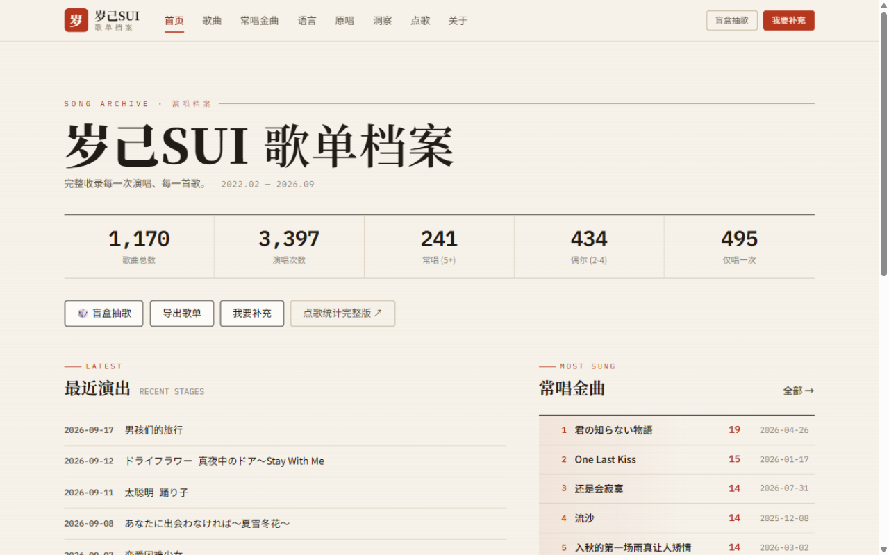

# 岁己SUI 歌单档案 · v3.7.1

> 为虚拟主播 [岁己SUI](https://space.bilibili.com/1954091502) 打造的演唱档案网站。
> **v3.0 全新重制**：数据与功能继承历代版本，页面结构、视觉系统、组件架构与交互完全从零重建。
> 当前界面版本 **v3.7.1**（历次迭代见站内「关于」页更新日志）。

收录 **1,170** 首歌曲、**3,399** 次演唱记录、**865** 条点歌互动，支持在线播放 B站录播片段。

**[>>> suijisui.uk <<<](https://suijisui.uk)** · [GitHub Pages 镜像](https://tsingyun.github.io/sui-song-list-new/) · [点歌统计](#点歌统计)

<p align="center">
  
</p>

---

## 视觉语言：场刊 / 档案簿

v3.0 采用「演出场刊 / 唱片目录」式的编辑排版系统，与旧版 Vaporwave 视觉完全告别：

- **暖纸底 + 墨色文字 + 朱红单强调色**，细线分隔替代卡片堆砌
- **衬线标题（Noto Serif SC）+ 无衬线正文（Noto Sans SC）+ 等宽数据字（IBM Plex Mono）**
- 全站无霓虹光效、无玻璃拟态、无 CRT 装饰、无大渐变；动画克制
- 桌面 / 平板 / 手机三态从零设计，无横向溢出，移动端歌单行两行堆叠
- **岁己符号系统（v3.6）**：把角色拆成一套可复用的图形符号 —— 光环·四芒星（立绘头顶铜环）、
  银喉长尾山雀（种族本体）、饼干（粉丝名「饼干岁」）、樱花（发饰）、辣椒（三餐无辣不欢），
  全部定义在 `scripts/sitegen/assets/css/sui.css` 一处，改一处即全站生效。
  符号按语义铺满全站而非零散点缀：**每个页面**标题区的大光环水印（由路由层统一注入，
  **新增页面自动获得**）、**每个数据区块**尾部的岁己注脚、**所有空状态**与清单空行的小鸟、
  返回顶部按钮上的栖枝小鸟（悬停振翅）、页脚新增的角色署名条（粉丝名 / 口味 / 出道日 / 应援口号）。
  所有符号均可溯源到公开设定，不凭空发明

## 功能总览

### 站点入口与首页视觉
- **顶栏导航永远可点**：`.site-head` 的层级高于所有页面级浮层（弹层遮罩 / 彩蛋遮罩 / 播放器），
  因此弹层打开、彩蛋弹出、播放器拖到最顶时，点标签都**真的会跳转**，而不是被遮罩接走事件后
  "看起来没反应"；弹层本体相应让位（不改顶栏高度就看得到 ✕），播放器拖拽也被限制在顶栏之下
- **窄屏导航**（≤640px）横向滚动时显示细滚动条，鼠标用户也能滚到溢出视野外的标签；
  语言页锚点条的吸顶位置按顶栏实测高度（`--head-h`）对齐，字体加载后也不会错位
- **左上角品牌位**（小鸟 Logo + 「岁己SUI 歌单档案」）整块可点击，**新标签页**前往
  [岁己SUI 的 B站个人空间](https://space.bilibili.com/1954091502)；带 `rel="noopener noreferrer"`，
  悬停有指针手势与轻微反馈，桌面端与移动端一致（地址常量：`scripts/sitegen/builder.py` 的 `BILI_SPACE_URL`）
- **首页主视觉立绘随机轮换**：每次打开/刷新从候选清单随机抽一张，同一会话内不与上一张重复；
  占位盒固定比例（切换不跳动）、加载淡入、图片失效自动退回兜底图
  （候选清单：`scripts/sitegen/builder.py` 的 `HERO_ART`）
- **首页「盲盒抽歌」**：右下角（原「点歌速览」位置）改为盲盒 —— 上方池子纵向自然滚动，随机抽样
  24 首循环经过（每次打开都是新的一批），下方一键抽取，复用顶栏盲盒的滚轮动画与结果面板
  （歌名 / 原唱 / 语言 / 演唱次数 + 播放或去 B站搜）；
  滚动机制是纯 CSS 的：内容复制一份后整体位移 −50%（`components.css` 的 `.marquee`），
  无缝、无定时器、高度固定不产生布局抖动

### 歌单浏览
- **hash 路由多视图**：首页 / 全部歌曲 / 常唱金曲 / 语言分类 / 原唱分类 / 数据洞察 / 点歌统计 / 关于
- **搜索**：歌名、译名、原唱实时过滤（防抖 220ms），命中关键词高亮
- **筛选**：语言（中/日/英/韩）；快捷筛选 全部 / 常唱(5+) / 偶尔(2–4) / 仅唱一次 / 很久没唱(≥180天)；
  33 种流派与企划标签（含计数）
- **排序**：演唱次数↓↑ / 歌曲名 / 最早演唱↑ / 最近演唱↓ / 最久没唱↑
- **分页**：50 首/页，窗口式页码
- Top10 演唱热度行标 ★ 并以朱红突出；统计数字图块可点击直达对应筛选

### 歌曲详情（可分享 URL）
- 每首歌独立路由 `#/song/<歌名>`，可分享、可前进后退
- 演唱次数 / 有记录场次 / 跨越年数；**年度×月份演出时间轴**（柱高=当月次数）
- 完整历史演出日期列表（首次/最新标记）；最近日期列悬停查看全部日期
- 关联 B站录播片段列表（日期 + 时长），点击即用浮动播放器播放
- 网易云搜索 / B站搜索外链、同原唱歌曲、按热度相邻导航、一键复制歌曲信息

### 在线播放
- 左下角**可拖拽浮动 16:9 播放器**，多版本下拉切换，放大/还原，B站原视频直链
- 无匹配片段时一键跳转 B站搜索（`岁己SUI <歌名> 歌切`）

### 数据洞察（手写 SVG/DOM 图表，零图表库依赖）
- **演唱日历热力图**：按年切换，悬停查看当日歌单（可点击直达歌曲详情）
- **月度趋势**：每月演唱次数 + 新歌数，自 2022-09 起连续统计
- **标签分布** 与 **原唱 Top 20**（歌曲数 / 演唱次数双序列）

### 点歌统计（原生集成）
- 2024-06 起全部点歌记录：总榜 / 月榜 / 季榜 / 年榜 / 热门歌曲榜，观众等级徽章 Lv.1–5
- **点歌占比**：完整榜单向下取整、末项补齐余数、总和严格 100%（歌曲榜因单项占比 <1% 采用 0.1% 粒度的同一规则）
- **🔥 连续点歌**：月内同观众在连续的「有点歌日」均点歌；纯主播日透明不中断；🔥 数量 = 连续场次 − 1
- 月度冠军 👑（并列全冠）、点歌之王、本月连续点歌墙、点歌趋势
- **点歌速览滚动带**（自首页迁入）：点歌之王 / 最近点歌 / 常点歌曲 / 本月连续四组卡片
  横向自然滚动循环经过（当月无连续点歌记录时只有三组），悬停暂停、尊重「减弱动效」偏好
- 观众详情：上次点歌距今、本期 / 过往歌曲、品味相近观众、B站主页直跳、复制用户信息
- **最近 15 天**：窗口内观众点歌次数与最近日期（含当月冠军 👑 与连续 🔥）
- **观众喜好**：Top 12 观众常点歌曲；新朋友（近 90 天首点）/ 老朋友回归（间隔 180 天以上）
- **跨月冠军**：连续数月蝉联月度榜首的观众
- **成就殿堂**：点歌之王 / 百首俱乐部 / 一周年纪念 / 忠实观众（首次进入视口撒彩纸）
- **时间区间筛选**：任意起止日期 → 观众排行 Top15 + 热门歌曲 Top10
- **歌曲详情**：谁点过这首歌（次数 / 最近日期），直达 B站 歌切搜索
- **搜索**：观众 / 歌曲 / 日期跨类型检索（含「谁是点歌大王」彩蛋）
- **导出**：CSV / JSON / Excel（SheetJS 惰性加载）/ PNG 截图（html2canvas 惰性加载，纸墨版式）
- 数据构建期从 `raw_data` 实时派生；原独立统计站 `sui-song-stats` 已于 2026-09 完整并入本页

### 工具
- **导出**：CSV（BOM）/ JSON（含时间戳）/ XLSX（SheetJS 惰性加载），导出当前筛选结果
- **盲盒抽歌**：随机一首 + 滚动揭晓动画（稀有度：常唱/偶尔/稀有），可立即播放；
  首页右下角另有一个同源入口（池子滚动 + 抽取按钮），两者共用同一套抽奖与结果面板
- **我要补充**：查重 → MusicBrainz / 网易云联网匹配原唱 + 语言探测 → 生成预填 GitHub Issue
- 返回顶部、面包屑、键盘可访问（焦点样式 / Esc 关闭弹层）

---

## 数据统计

| 指标 | 数量 |
|------|------|
| 歌曲总数 | 1,170 |
| 演唱总次数 | 3,399 |
| 常唱 (5+次) | 241 首 |
| 偶尔 (2–4次) | 434 首 |
| 仅唱一次 | 495 首 |
| B站录播匹配 | 905 首 |
| 有逐日记录的歌曲 | 1,156 首 |
| 点歌记录（2024-06 起） | 865 条 / 87 位观众 / 511 首 |
| 收录时间跨度 | 2022.02 — 2026.09 |

---

## 项目结构

```
sui-song-list-new/
├── README.md / LICENSE / REBUILD_NOTES.md    ← 重建前的逆向产品分析
├── AGENTS.md                                 ← AI 助理工作手册
├── .github/workflows/rebuild.yml             ← push data/ 或 scripts/ 自动重建
├── data/
│   ├── song_data.json                        ← 核心歌曲库（1170 首）
│   ├── song_bilibili_map.json                ← 歌曲-录播匹配（932 条）
│   ├── sui_song_list_complete.json           ← 源站原始数据（含逐日日期表）
│   └── request_stats.json                    ← 点歌数据主源（raw_data/live_dates/uids）
├── scripts/
│   ├── build_site.py                         ← 构建入口（Actions 调用此路径）
│   ├── import_request_stats.py               ← 从 sui-song-stats 导入点歌主源
│   ├── add_songs.py 等维护脚本                ← 加歌 / 审计 / 匹配（沿用）
│   └── sitegen/                              ← 新构建器（纯标准库）
│       ├── datalayer.py                        歌曲数据层：合并 bilibili、日期归一化、聚合统计
│       ├── reqstats.py                         点歌规则层：榜单/占比/🔥/等级/冠军/趋势
│       ├── builder.py                          组装器：骨架 + CSS/JS 内联 + 数据注入
│       └── assets/
│           ├── skeleton.html                   页面骨架（含顶栏品牌位外链占位）
│           ├── sui-*.webp / sui-bird.png       立绘与吉祥物素材（HERO_ART 候选图在此）
│           ├── css/                            设计系统（tokens/base/layout/components/views/responsive）
│           └── js/                             前端（domain/core/components/各视图/app）
└── docs/                                     ← GitHub Pages 部署目录
    ├── index.html                            ← 构建产物（单文件，~925KB）
    ├── assets/                               ← 立绘 / 光标 / 吉祥物等静态资源
    ├── CNAME                                  ← suijisui.uk
    └── screenshot.png
```

**数据流**：`data/*.json → datalayer（歌曲域）+ reqstats（点歌域）→ builder 注入 → docs/index.html`
前端只做视图层工作（筛选/排序/渲染），所有统计与业务规则在构建期一次算好。

---

## 构建与维护

### 构建网站

```bash
python -X utf8 scripts/build_site.py     # Windows 加 -X utf8；输出 docs/index.html
```

零第三方依赖（Python 标准库即可），GitHub Actions 环境直接可用。

### 数据更新

```bash
# 已有歌曲又唱了一次
python -X utf8 scripts/add_songs.py --name "流沙" --date "2026-06-14"

# 全新歌曲
python -X utf8 scripts/add_songs.py --name "新歌" --artist "原唱" --lang "中文" --date "2026-06-14"

# 同步点歌数据（从 sui-song-stats 仓库）
python -X utf8 scripts/import_request_stats.py <song_data_processed.json 路径>
```

也可以在 GitHub 网页上编辑 `data/song_data.json` 提交，Actions 会自动重建并提交 `docs/index.html`。

### 修改网站 UI

编辑 `scripts/sitegen/assets/` 下的 skeleton / css / js 源文件后重新构建。**不要手改
`docs/index.html`**——它会被下次构建整体覆盖。

两处常用常量都集中在 `scripts/sitegen/builder.py`，改一个地方即可，不用碰前端源码：

| 常量 | 作用 | 改法 |
|------|------|------|
| `BILI_SPACE_URL` | 左上角品牌位跳转的 B站空间地址 | 直接改字符串（`__BILI_SPACE_URL__` 占位在构建时替换） |
| `HERO_ART` | 首页主视觉立绘轮换候选 | 图片放进 `scripts/sitegen/assets/`，清单里加文件名；第一项为加载失败兜底图 |

> 新增立绘无需改 CSS：占位盒固定 `aspect-ratio`，不同比例的图自动等比适应、底部对齐。

---

## 不可改变的业务规则（详见 REBUILD_NOTES.md）

- 常唱/偶尔/仅唱一次阈值：5 / 2 / 1；总数 = Σ演唱次数；tier 由 count 现算
- 日期归一化 `YYYY-M-D → YYYY-MM-DD`，过滤 <2022 的垃圾日期；热力图/趋势自 2022-09 起
- 歌名与录播匹配键的波浪号归一化（U+301C/U+FF5E → U+007E）
- `song_data.json` 中的 `stats`/`tier`/`lang_counts` 是冗余字段，构建时重算
- 点歌占比 / 🔥 / 观众等级 / 月度冠军规则见上文与 `scripts/sitegen/reqstats.py` 注释

---

## 数据来源与致谢

- 歌曲基础数据：[suijisui.space](https://www.suijisui.space)（[PQL87/sui-song-list](https://github.com/PQL87/sui-song-list)）
- 演唱日期：suijisui.space + 本地统计表（2024-06 起以本地表为准）
- B站录播：岁己SUI 的投稿合集（标题归一化多策略匹配）
- 点歌数据：[Tsingyun/sui-song-stats](https://github.com/Tsingyun/sui-song-stats)
- [岁己SUI](https://space.bilibili.com/1954091502) — 小岁小岁我们喜欢你

## License

[MIT License](LICENSE)
